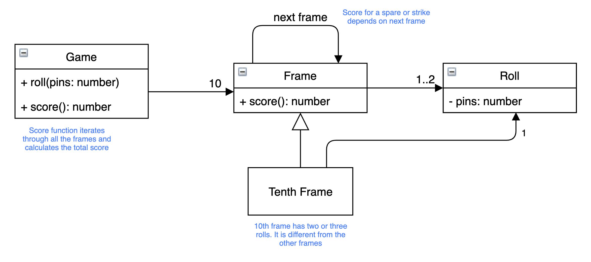

## Bowling scores

- a game consists of 10 frames
- in each frame, the player can roll the ball twice to knock down 10 pins
- the score for the frame is the total number of pins knocked down, plus bonuses for strikes and spares
- a spare is when the player knocks down all 10 pins in two tries. The bonus for that frame is the number of pins knocked down by the next roll. e.g. if the player gets a spare in frame two and knocks down 4 pins on the first roll of frame three, then the score for frame two is 14
- a strike is when the player knocks down all 10 pins on the first try. The bonus for that frame is the value of the next two balls rolled
- in the 10th frame a player who rolls a spare or strike is allowed to roll an extra time, up to three rolls. e.g. if player rolls a spare, he gets one more roll. if he rolls a strike, he gets two more rolls.

### Design

#### Logical Model:



#### A starting point:

```typescript
class Game {
  // called each time a player rolls a ball
  roll(pins: number): void {}

  // called only at the end of the game
  score(): int;
}
```

### Tooling

[VSCode Jest extension](https://github.com/jest-community/vscode-jest)
